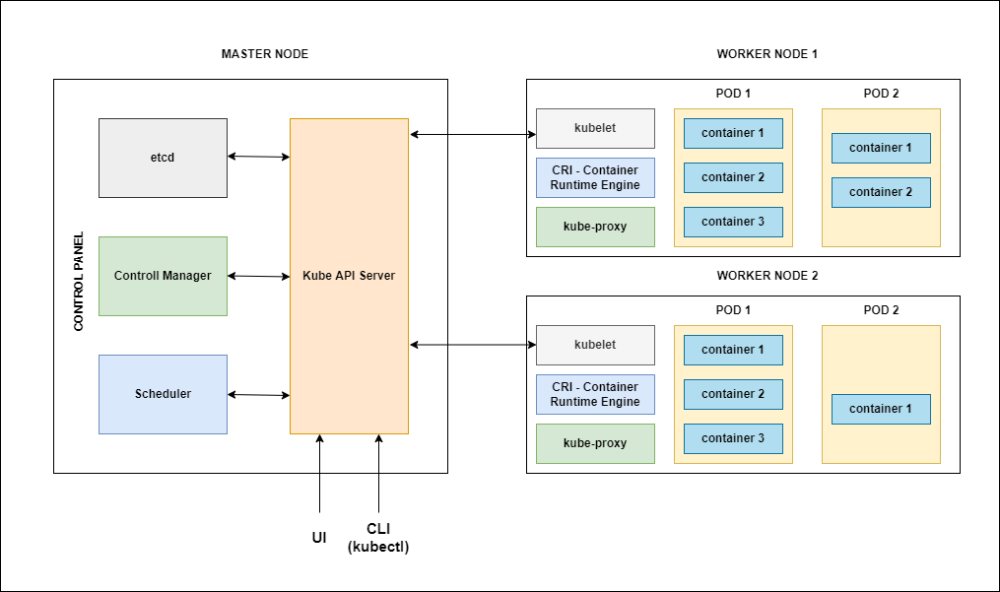

# Kubernetes Architecture

-   When you deploy Kubernetes, you get a **cluster**
-   A cluster is a set of machines, called **nodes**
-   A cluster has atleast one **worker node(minions)** and atleast one **master node**
-   There can be multiple **clusters** in a Kubernetes architecture
-   A node can be a 
    -   Physical machine
    -   Virtual machine
    -   VM on cloud
-   Kubernetes uses single responsibility principle, so each component of K8S is responsible only for one responsibility
-   Every node in Kubernetes cluster must run a container runtime like docker

## Master Node (Control Plain)
-   Master node is responsible for managing the entire cluster
-   There can be more than one **master node** in a cluster to provide a cluster with failover and high availability
-   The control plain or master node(s) manages the worker nodes and the pods in the cluster.
-   It monitors the health check of all nodes in cluster, stores member's information regarding different nodes, plans the container that are scheduled to certain worker nodes, monitor containers and nodes etc
-   So when worker node fails, the master moves the workload from the failed node to another healthy worker node
-   4 Components of master node
    -   **API Server** or **kube-apiserver**
    -   **Scheduler** or **kube-scheduler**
    -   **Control Manager** or **kube-controller-manager**
    -   **ETCD**

## Worker Node (Data Plain)
-   K8S cluster consists of set of worker machines called nodes, that run the containerized application.
-   The worker nodes hosts the pods that are the components of the application
-   4 Components of worker node
    -   **kubelet** or **Node Agent**
    -   **kube-proxy** or **Networking component**
    -   **Container runtime**
    -   **Pod**
-   The worker node(s) hosts the **pods** that are the components of the application workload.

## API Server(kube-apiserver)
-   API server is the front-end of the control plain(Master node) and the only component in the control plain(Master node) that we can interact with directly. Internal system components as well as external user components all communicate via same API
-   API Server is used for all communication
-   Exposes API for almost every operation
-   Users interact with the API using a tool called **kubectl**
-   **kubectl** is a command line utility to interact with Kubernetes API
-   **kubectl** is a GO Language binary

## Scheduler (kube-scheduler)
-   schedules pods across multiple nodes
-   Components on the master node that watches newly created pods that have no node assigned, and selects a node for them to run on
-   Scheduler gets the information for hardware configuration from configuration file and schedules the pods on nodes accordingly. 
-   Scheduler is responsible for identifying the right node interms of CPU, memory(RAM) etc from the available worker nodes for the resource creation.
-   Scheduler takes cares of creating,updating and deleting the containers

## Control Manager (kube-controller-manager)
-   Control manager maintains the cluster. It handles node failures, replicate components, maintains the correct number of pods etc. 
-   It constantly tries to keep the system in the desired state by comparing it with the current state of the syetem.
-   It make sures that both desired state and current state are matching with each other
-   The Control manager is the control plain/master component that run controller processes
-   Logically each controller is a separate process, but to reduce complexity, they are all compiled into a single binary and run in a single process.
-   Some of the controllers are:
    -   Node controller
        -   Responsible for noticing and responding when nodes go down
    -   Job controller
        -   watches for job objects that represent one-off tasks, then creates pods to run those tasks to completion.
    -   Endpoints controller
        -   Polulates the endpoints objects(that is,joins Services and Pods)
    -   Service account and Token controller
        -   Create default accounts and API access tokens for new namespaces

## ETCD (Distributed database)
-   **ETCD** - Open Source, Distributed key-value database from CoreOS
-   Single source of truth for all components of the Kubernetes cluster
-   Out of all master components only the API Server is able to communicate with the ETCD datastore
-   ETCD can be part of Kubernetes Master OR it can be configured externally
-   etcd is a data store that stores cluster configuration. it is a distributed reliable,key-value store, all the objects are stored as documents and it's schema-less.

## kubelet or Node Agent
-   Kubelet is an agent that runs on each node in the cluster. It make sure that containers are running in a pod.
-   communicates with components from the master node
-   In case any Pod has any issue, kubelet tries to restart the pods on the same node or a different node
-   Kubelet doesnot manage the containers which are not created by Kubernetes
-   Kubelet takes a set of PodSpecs that are provided through various mechanisms and ensures that the containers described in those PodSpecs are running and healthy.

## kube-proxy or Networking component
-   A network agent which runs on each node responsible for maintaining network configuration and rules
-   Core networking components in Kubernetes
-   Exposes services to the out-side world
-   All worker node runs on a deamon called kube-proxy, which watches the **API server on the master node** for the addition and removal of services and endpoints. 
-   Kube-proxy is a network proxy that runs on each node in your cluster, implementing part of the kubernetes Service concept.
-   kube-proxy maintains network rules on nodes. these network rules allow network communication to your pods from network sessions inside or outside of your cluster.

## container runtime
-   The container runtime is a software that is responsible for running containers
-   Kubernetes supports several container runtimes
    -   Docker
    -   Containerd
    -   Cri-o
    -   Rktlet
    -   Kubernets CRI(Container runtime interface)
-   Kubernetes doesnot have the capability to directly handle containers
-   In order to run and manage a container's lifecycle, kubernets requires a container runtime on the node where a Pod and its containers are to be scheduled

## Pod
-   pod is a collection of containers that can run on a host.
-   Pod is the smallest deployable unit in K8S
-   Container lives inside a pod
-   Each pod gets a unique IP address
-   Pod can contain many containers
-   containers in a pod share resources
-   with in a pod container can talk to each other using localhost

## Addons
-   Add-ons are the extended functionality of kubernetes
-   Addons uses K8S resources to implement cluster feature,because these are proving cluster level features.
-   namespaced resource for addons belonging within the **kube-system** namespace.
-   **DNS**
    -   Cluster DNS is a DNS Server, required to assign DNS records to Kubernetes objects and resources.
    -   Containers started by K8S automatically include this DNS server in their DNS Searches.

-   **Web UI (dashboard)**
    -   Dashboard is a general purpose, web-based UI for K8S cluster
    -   It allows users to manage and trobleshoot applications running in the cluster, as well as the cluster itself.

-   **Container resource monitoring**
    -   collect cluster level container metrics and saves them to a central data store and provides a UI for browsing that data.

-   **Cluster-level logging**
    -   It collect cluster level container logs and saves them to a central log store for analysis with search/browsing interface.

## Questions
-   What happens if the master node goes down ? will the entire application is down ?
    -   Ans : No. The applications can continue run working even with master node down. Because while we access the application url the master node doesnot get involved at all.
-   Is there any single point of failure in Kubernetes ?
    -   Ans : No. 

## Disadvantages
-   Kubernetes supports not more than 5000 nodes
-   Kubernetes supports not more than 1,50,000 total pods
-   Kubernetes supports not more than 3,00,000 total containers
-   Kubernetes supports not more than 100 pods per node