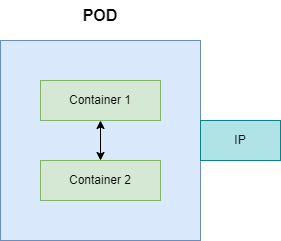

# Pod

-   Group of whales is called Pod
-   Pod is the smallest deployable unit in K8S
-   pod is a collection of containers that can run on a host.
-   pod is an abstraction over container
-   Container lives inside a pod
-   Each pod gets a unique IP address
-   containers in a pod share resources
-   with in a pod container can talk to each other using localhost
-   Usually one application per pod
-   Pod can be treated as a Virtual Machine. So Pod should have following configurations 
    -   CPU
    -   RAM
    -   Hard disk



## commands
- ```kubectl get pods```
- ```kubectl run <pod_name> --image=<image_name> --port=<container_port>```
- ```kubectl get pods <pod_name>```
- ```kubectl get pods <pod_name> -o wide```
- ```kubectl get pods <pod_name> -o yaml```
- ```kubectl port-forward <pod_name> <host_port>:<container_port>```
- ```kubectl delete pods <pod_name>```
- namespace specific component can be found with option ```-n <namespace_name>```

## YAML configuration
-   Pod.yaml
```aidl
apiVersion: v1
kind: Pod
metadata:
  name: <pod_name>
  namespace: <namespace_name>
  labels:
    <key>: <value> ## This will help in monitoring, service discovery and load balancing
spec:
  containers:
  - name: <container_name>
    image: <image_name>[:<version>]
    imagePullPolicy: <image_pull_policy>[Always,IfNotPresent]
    ports:
    - containerPort: <container_port>
      protocol: <protocol>
    resources:
      requests:
        memory: "<memory_request>"
        cpu: "<cpu_request>"
      limits:
        memory: "<memory_limit>"
        cpu: "<cpu_limit>"
```

- ```kubectl apply -f Pod.yaml```
- ```kubectl get pods -n <namespace_name>```
- ```kubectl delete -f Pod.yaml```