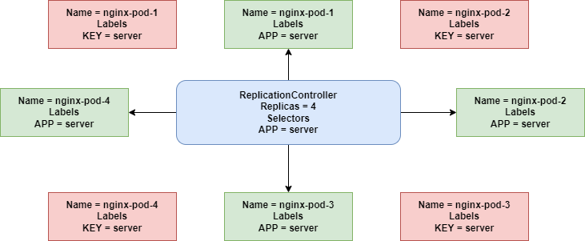

# Replication controller

-   A ReplicationController ensures that a specified number of pod replicas are running at any one time.
-   In other words, a ReplicationController makes sure that a pod or a homogeneous set of pods is always up and available.
-   If there are too many pods, the ReplicationController terminates the extra pods.
-   If there are too few, the ReplicationController starts more pods.
-   Note: **You should always use ReplicationController even if you need a single pod, because your pods are re-created on a node after disruptive maintenance such as a kernel upgrade **
-   RC will launch a specified number of pods called replica's and make sure that they keep running.
-   ensures that specified number of pods running at any time.
-   If any extra pods are running it will kill that pod and vise varsa
-   New pod get launched when the pod gets failed, deleted or terminated.
-   ReplicationController can manages Pods created outside ReplicationController as well using the ```selector```



## YAML configuration
- ReplicationController.yaml
```
apiVersion: v1
kind: ReplicationController
metadata:
  name: <rc_name>
  namespace: <namespace>
  metadata:  
    labels:     ## .spec.template.metadata.labels  but can be anything it doesn't affect the behaviour of RC
      <key>: <value>
spec:
  replicas: <replica_count>
  selector:     ## .spec.template.metadata.labels  based on these labels only RC selects the pods
    <key>: <value> 
  template:
    metadata:
      labels:    
        <key>: <value>
    spec:
      containers:
      - name: <pod_name>
        image: <image_name>
        imagePullPolicy: <image_pull_policy>
        ports:
        - containerPort: <port>
          protocol: <protocol>
        resources:
          requests:
            memory: <request_memory>
            cpu: <request_cpu>
          limits:
            memory: <limit_memory>
            cpu: <limit_cpu>
```

- ```kubectl get rc```
- ```kubectl get rc <replication_controller>```
- ```kubectl delete rc <replication_controller>```


- Note: **The Replication Controller is the original form of replication in Kubernetes.  It's being replaced by Replica Sets**