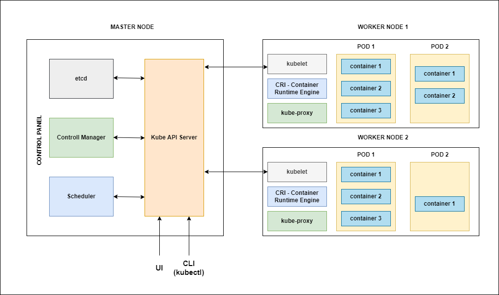

# Kubernetes Architecture

### Master node (Control Plain)
-   Master node is responsible for managing the entire cluster
-   It monitors the health check of all nodes in cluster, stores member's information regarding different nodes, plans the container that are scheduled to certain worker nodes, monitor containers and nodes etc
-   So when worker node fails, the master moves the workload from the failed node to another healthy worker node
-   API server is the front-end of the control plain and the only component in the control plain that we can interact with directly. Internal system components as well as external user components all communicate via same API
-   Scheduler component watches for newly created pods with no assigned node, and selects a node for them to run on
-   Control manager maintains the cluster. It handles node failures, replicate components, maintains the correct number of pods etc. It constantly tries to keep the system in the desired state by comparing it with the current state of the syetem.
-   etcd is a data store that stores cluster configuration. it is a distributed reliable,key-value store, all the documents are stored in documents and it's schema-less.

### Worker node (Data plain)
-   Worker node is nothing but a Virtual machine running in cloud or on-premise. So any hardware capable of running container runtime can become a worker node. these node expose underlying compute, storage and networking to the applications.
-   Pods are smallest unit of deployment in kubernetes just like a container is the smallest unit of deployment in Docker.
-   For our understanding we can say that Pods are the light weight VM in the virtual world.

### Kube Scheduler
-   Scheduler is responsible for identifying the right node interms of CPU, memory(RAM) etc from the available worker nodes for the resource creation.
-   Scheduler takes cares of creating,updating and deleting the containers
-   
### Controller Manager
-   Make sures that both desired state and current state are matching with each other
-   

## Questions
-   What happens if the master node goes down ? will the entire application is down ?
    -   Ans : No. The applications can continue run working even with master node down. Because while we access the application url the master node doesnot get involved at all.

 